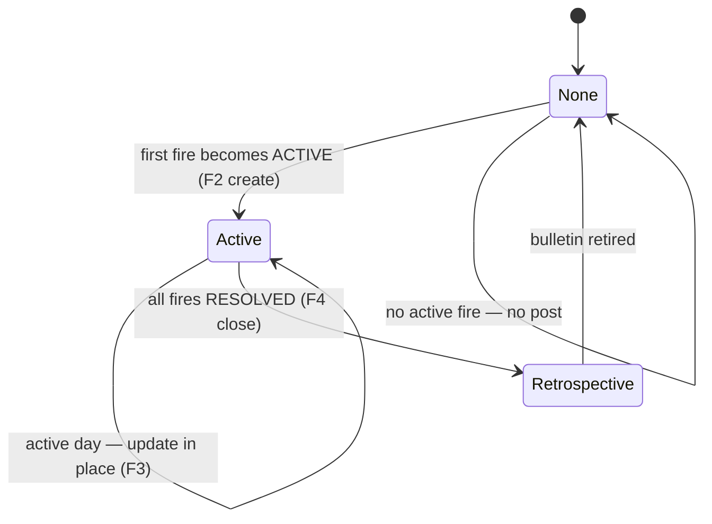

# Live-updating wildfire bulletins on the blog

## Summary

Add an automated "current wildfire situation" bulletin to the blog: a single post that covers every fire active in Calaveras & Tuolumne, updates in place each morning while any fire burns, and closes as a retrospective at all-clear. It narrates official CAL FIRE figures pulled from the `sierra-grid` MCP ("how the day moved"), always defers to `/live` and CAL FIRE for real-time status, and ships through the Signal Desk's existing Writer→Critic→member-review gate.

## Problem Frame

Today the automated desk is forbidden from touching live incidents. The news-feed brief draws a hard boundary — _"never publish news about an unfolding incident… during an emergency, stale information is dangerous… the correct output is no post"_ — and routes anything happening now to `/live`. That rule is correct about the failure mode (a static post that says "60% contained" is dangerous once it's hours old) but it leaves a real gap: `/live` is a dashboard of current numbers, and a reader scanning it can't easily see _what changed_ or _which way a fire is trending_. Jay's idea is the missing narrative layer — a short daily "here's where the two fires stand and how the day moved them," in plain language, sitting where people already read (the blog and its feed).

The tension the brainstorm resolved: keep the brief's safety intent while allowing the coverage. A bulletin is safe not because it's fast but because it is honestly framed as a **daily digest of official figures, timestamped, never the authoritative source** — with the real-time channels one click away. That narrows the boundary from "never cover active fires" to "never present the blog as the live source," rather than deleting it.

## Key Decisions

- **Digest, not a live mirror.** The bulletin is a once-daily narrative of official figures, not a real-time feed. Every figure is timestamped ("as of ~06:54 PT") and the post is capped with a standing pointer to `/live` + CAL FIRE. This is what makes crossing the brief's boundary safe.
- **One combined bulletin covers all active fires.** A single "current wildfire situation" post spans every active fire in the two counties, rather than one post per fire. Simultaneous fires are one feed item; the title adapts to how many are burning.
- **Daily while active, even on "no change."** Silence during a multi-day fire reads as an all-clear, which the honesty rules forbid. The desk publishes an update every active day — including "held flat overnight, still 60% contained" — with a taper for long, stable, high-containment fires.
- **Coexist with regular posts, pause them in a major fire.** The fire bulletin takes the morning slot; regular tech/explainer posts keep their cadence in a separate later slot. During a _major_ fire — an active evacuation **order** (not merely a warning) tied to a wildfire — the regular posts pause: a cheerful firmware post the morning after an order goes out reads as tone-deaf.
- **Keep the human-review gate.** Fire updates go through the same Writer→Critic→PR→member-approval flow as every other desk post. The digest framing makes the review latency acceptable, and a human stays on life-safety-adjacent copy.
- **Retire to a retrospective at all-clear.** When every fire in the bulletin is resolved, a final update closes it and reframes it as a look-back (the brief already welcomes retrospectives). It stops bumping. A fresh outbreak after that starts a new post.

## Actors

- A1. **Signal Desk writer** — the scheduled LLM agent that reads the Grid, decides whether to act, and drafts or updates the bulletin.
- A2. **Signal Desk critic** — the adversarial-review LLM agent that edits or vetoes the draft before it can open a PR.
- A3. **Reviewing member** — a S.I.E.R.R.A volunteer who approves and merges the PR; nothing publishes without this.
- A4. **Reader** — a foothill resident or volunteer, scanning the blog/feed rather than watching `/live`.
- A5. **The Grid (`sierra-grid` MCP)** — the read-only data source at `data.sierragridteam.org/mcp`.

## Key Flows

The bulletin has a small lifecycle; the daily run routes into one of four paths.

- F1. **Daily run decision**
  - **Trigger:** the morning scheduled run.
  - **Actors:** A1, A5
  - **Steps:** Query the Grid for active fires in the two counties. If none and no open bulletin → no post (F1 exits). If ≥1 active and no open bulletin → F2. If an open bulletin exists and ≥1 fire still active → F3. If an open bulletin exists and all its fires are now resolved → F4.
  - **Covered by:** R6, R7, R11

- F2. **Create a new bulletin**
  - **Trigger:** first fire becomes active with no open bulletin.
  - **Steps:** Write the current-status section + first dated update from Grid figures; set the title from the active-fire count; open a PR for member review.
  - **Covered by:** R1–R5, R8, R20–R23

- F3. **Update the open bulletin**
  - **Trigger:** an open bulletin exists and ≥1 fire is still active.
  - **Steps:** Compute the delta since the last update; prepend a new dated update; rewrite the current-status section; add any newly-active fire and mark any newly-resolved fire; refresh the title and the "last activity" stamp; open a PR.
  - **Covered by:** R6, R9, R12, R14–R16

- F4. **Close to a retrospective**
  - **Trigger:** every fire in the open bulletin is resolved.
  - **Steps:** Prepend a final "all contained/resolved" update, reframe the lead as a look-back, retag as a retrospective, and stop bumping the post. The bulletin is now retired.
  - **Covered by:** R10, R13

## Requirements

**Content & voice**

- R1. Each update reports only official figures available from the Grid: per-fire name, location/area, acreage, containment %, severity, status, plus evacuation level and fire-weather state when present.
- R2. Each update leads with the delta — how each fire moved since the last update (contained up, acreage flat, severity downgraded), not just a static snapshot.
- R3. Every figure is attributed to its observation time in Pacific ("as of ~06:54 PT"); the post never implies its numbers are current-to-the-minute.
- R4. The voice follows the existing desk brief and content style guide: calm, factual, institutional, no first-person singular, no alarmism, terms defined for a smart generalist.
- R5. Each fire links its canonical CAL FIRE incident page (from the Grid event's source link); the post links `/live` for the live map and Cal OES / Genasys for evacuation zones.

**Lifecycle: update vs. new**

- R6. At most one bulletin is "open" (actively updating) at a time; while open it is updated in place, never duplicated into a second post.
- R7. A bulletin opens when ≥1 fire is active in the two counties and none is open; the post's slug and `pubDate` are fixed at the episode's start and never change.
- R8. Fires are tracked by stable Grid event id; the set of active ids defines the bulletin's scope. A newly-active fire while a bulletin is open is folded into that same bulletin.
- R9. A fire that resolves while others burn is marked resolved within the open bulletin but does not close it.
- R10. When every tracked fire is resolved the bulletin closes (F4) and will not reopen; a later outbreak starts a fresh bulletin.

**Cadence**

- R11. While a bulletin is open the desk publishes an update every active day, including a "no material change" update when figures held flat.
- R12. Any material change — a new fire, a containment/severity move, a new evacuation — triggers an update on the next scheduled run regardless of the taper.
- R13. For a fire with no material change for 3+ consecutive days and high containment, the cadence tapers to roughly every third day, carrying a standing "still active, last changed <date>" line, until a change or resolution.

**Feed presentation**

- R14. The bulletin bumps to the top of the feed on each update, ordered by most-recent activity rather than original publication date.
- R15. In the feed listing, the bulletin shows only its current-status section and the latest dated update; older updates are not shown in the feed.
- R16. The permalink shows the full reverse-chronological timeline of every update for the episode.

**Scheduling & coexistence**

- R17. The fire bulletin runs in the morning slot; regular (non-fire) posts run on their own cadence in a separate, later slot.
- R18. An active fire no longer suppresses regular posts by default — the two coexist.
- R19. During a _major_ fire — defined as an active evacuation **order** (not a warning) tied to a wildfire — regular posts pause until the order lifts or the fire resolves.

**Editorial safety (hard rules, non-negotiable)**

- R20. The bulletin never issues emergency instructions (no "evacuate," "shelter in place," or all-clears) and never characterizes S.I.E.R.R.A's own response.
- R21. An `ACTIVE` fire is never described as over, even at high containment; the post states plainly that CAL FIRE has not called it resolved.
- R22. A source that is `UNAVAILABLE`/absent reads as "Unknown," never as "0" or safe — mirroring the MCP's own contract and the site's data-honesty rules.
- R23. Every bulletin carries the standing hazards disclaimer and the desk colophon/disclosure line.

**Data source**

- R24. Data comes from the `sierra-grid` MCP (`grid_situation`, `grid_events`, `grid_event`, `grid_conditions`) at `data.sierragridteam.org/mcp`; the desk verifies figures are reference-only and cites official sources.
- R25. The desk computes the day's delta from prior-run state (e.g., `grid_events` with `since=`/`status=` and per-fire typed detail), so "how the day moved" is grounded, not inferred.
- R26. Resolution is confirmed from the Grid (a fire moving to `RESOLVED`/absent), not assumed from high containment.

**Titling**

- R27. The title reflects the count of active fires: one is named ("Priest Fire update"); two are both named ("Priest and Landrum Fire updates"); three or more use the generic count form ("N active wildfires in the foothills"). The title updates as fires start and resolve, and drops "update(s)" framing when the bulletin closes to a retrospective.

## Acceptance Examples

- AE1. **Covers R6, R8.** A bulletin is open for the Priest Fire. The Landrum Fire becomes active. **Then** the next run folds Landrum into the same bulletin (not a new post) and the title becomes "Priest and Landrum Fire updates."
- AE2. **Covers R1, R2, R11.** Overnight, Priest holds at ~10 acres and containment is unchanged. **Then** the day's update still publishes, leading with "held flat overnight, still 60% contained" — not silence.
- AE3. **Covers R27.** Four fires are active at once. **Then** the title uses the generic count form ("4 active wildfires in the foothills") rather than naming them; 1–2 active fires are named, 3+ use the count form.
- AE4. **Covers R9, R10.** Landrum reaches 100% and resolves while Priest still burns. **Then** Landrum is marked resolved inside the bulletin, the bulletin stays open, and the title reverts to "Priest Fire update." When Priest later resolves too, the bulletin closes as a retrospective (F4).
- AE5. **Covers R19.** An evacuation order is issued for a fire. **Then** that day's regular tech/explainer post is suppressed; only the fire bulletin publishes until the order lifts.
- AE6. **Covers R22, R26.** The evacuation feed is `UNAVAILABLE` on a run. **Then** the bulletin says evacuation status is "Unknown — check Genasys," never "no evacuations," and does not treat the fire as trending safe.
- AE7. **Covers R10, R7.** Two weeks after the episode closed as a retrospective, a new fire starts. **Then** a fresh bulletin is created with a new slug/date; the retired retrospective is untouched.

## Scope Boundaries

- The `sierra-grid` MCP server and the `/live` page are out of scope — this feature is blog-side only, consuming existing Grid data.
- Per-fire individual posts, and a genuinely major fire "graduating" to its own dedicated post, are deferred — v1 is one combined bulletin.
- Auto-publishing without member review is out — the review gate stays.
- Twice-daily or real-time updating is out — this is a once-daily digest by design.
- Non-fire hazards (storm/PSPS/evacuation-only situations) as live bulletins are out of v1; this feature is scoped to wildfire. (The lifecycle could generalize later.)

## Dependencies / Assumptions

- The `sierra-grid` MCP is reachable and stable from the CI environment the desk runs in (verified reachable from this sandbox: `initialize` + `tools/list` succeed; REST situation endpoint returns 200).
- "Bump to top" and "hide older updates in the feed" require net-new blog mechanics — an `updatedDate`-style field, feed ordering by most-recent activity, and a per-post feed excerpt/fold. The blog currently has neither (schema in `src/content.config.ts` carries only `pubDate`; `src/pages/blog/index.astro` sorts by `pubDate` and renders recent posts in full).
- The desk can persist or re-derive prior-run state to compute deltas across runs.
- A reviewing member is reachable in a reasonable window each morning; if not, the bulletin publishes late (acceptable given the digest framing).
- The `.github/workflows/news-desk.yml` cadence guard and single-run assumption can accommodate two output types on different schedules.

## Outstanding Questions

All product decisions are resolved; the following are deferred to planning (answered during implementation).

- Whether the two output types become two separate workflows or one workflow with a mode switch (affects R17/R18 scheduling) — an implementation-shape call.
- The taper thresholds (containment %, day count) in R13 — start with 3 days / high containment, tune editorially.
- How prior-run delta state is stored or re-queried (R25).
- The feed excerpt/fold mechanism and the `updatedDate` field shape (rendering + schema detail).
- The morning/afternoon exact cron times for the two slots.

## Sources / Research

- `docs/news-feed-content-brief.md` — the editorial brief; §3 hard boundary on unfolding incidents, §10 hard rules (no instructions, hazards disclaimer). This feature narrows §3.
- `docs/content-style-guide.md` — voice, terminology, and the data-honesty rules ("Unknown," not "0"; never imply an all-clear).
- `.github/workflows/news-desk.yml` — the desk automation: daily cron `30 16 * * *` (~08:30–09:30 PT), 3-day cadence guard, Writer→Critic→PR→member-review flow.
- `src/content.config.ts` — blog frontmatter schema (`title`, `description`, `pubDate`, `tag`, `author`); no `updatedDate` today.
- `src/pages/blog/index.astro` — feed sorts by `pubDate`, renders `recentCount` posts in full.
- `sierra-grid` MCP (`data.sierragridteam.org/mcp`) — tools `grid_situation`, `grid_events` (`since`/`status`/`layer`/`severity_min`), `grid_event` (typed detail + canonical source link, ids like `calfire:2026-priest-fire`), `grid_conditions`. Server instruction: _"never treat null/absence as safe."_
- Shipped `provenance.source_url` work (alert cards + map popups link the CAL FIRE incident page) — the same source link the bulletin reuses per R5.
